# A tour

What each tab does, with pictures. Setup and reference live in the [guide](GUIDE.md).

## Vibes

Artists you play in the same sessions are grouped into "vibes", named by when you play them. Arcs show what bridges one vibe to another, and the panel says why: how often you switch mid-session, which direction you drift, and the song you usually cross over on.

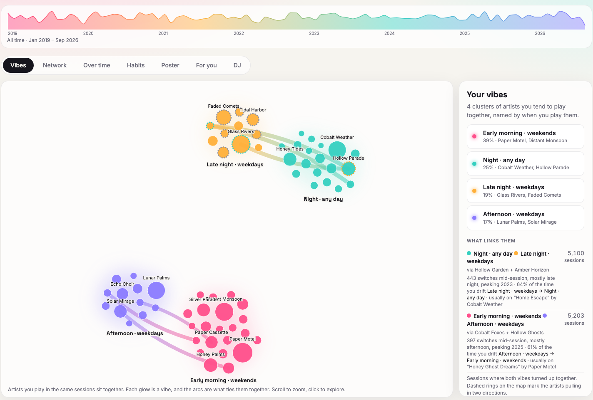

## Network

The same artists as a web of co-listening. Links that cross between vibes are drawn in both vibes' colors, and "Bridges only" fades everything that stays inside one vibe.

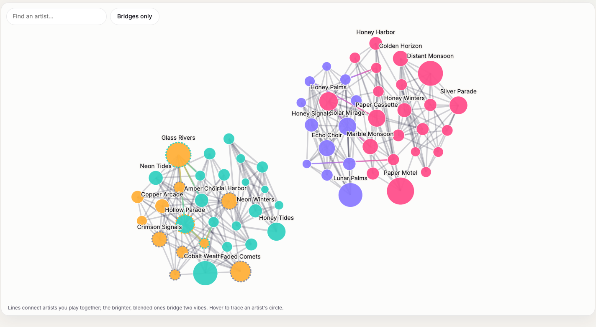

## Over time

A streamgraph of your top artists, or of your vibes, month by month. Drag across the bar at the top of any view to zoom into a period; every view follows that range.

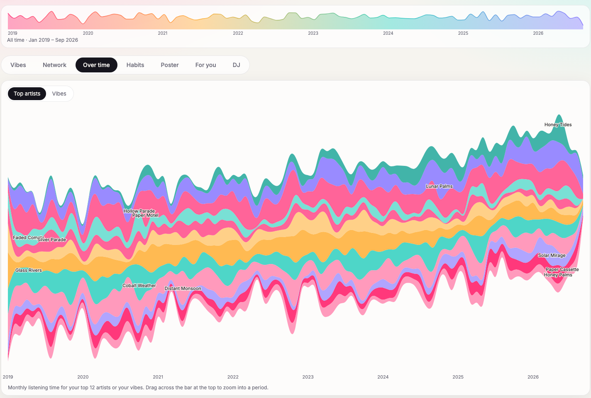

## Habits

When you listen, hour by hour across the week, with your peak outlined. Below it: biggest day, longest streak, share of days with music, weekend share, and a calendar where every square is a day.

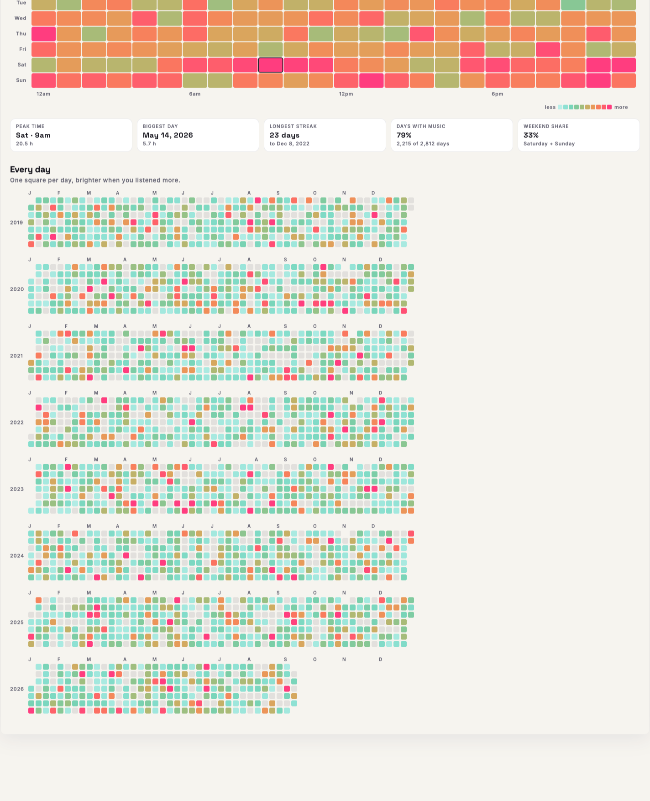

## Poster

A print of your listening, exported as PNG (3000 × 4242) or SVG.

| Aurora | Year rings | Constellation |
| --- | --- | --- |
| 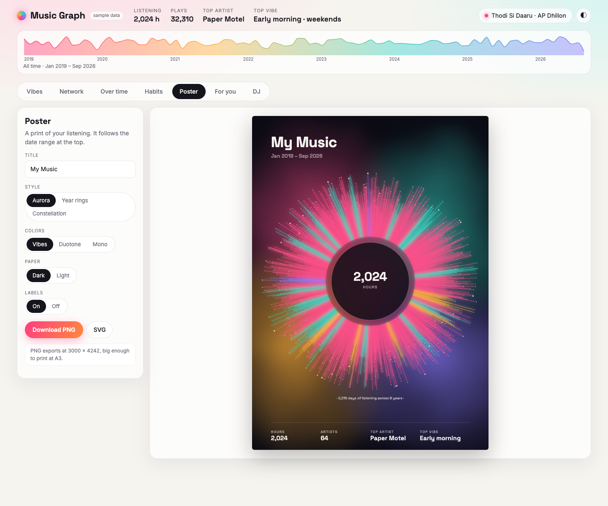 | 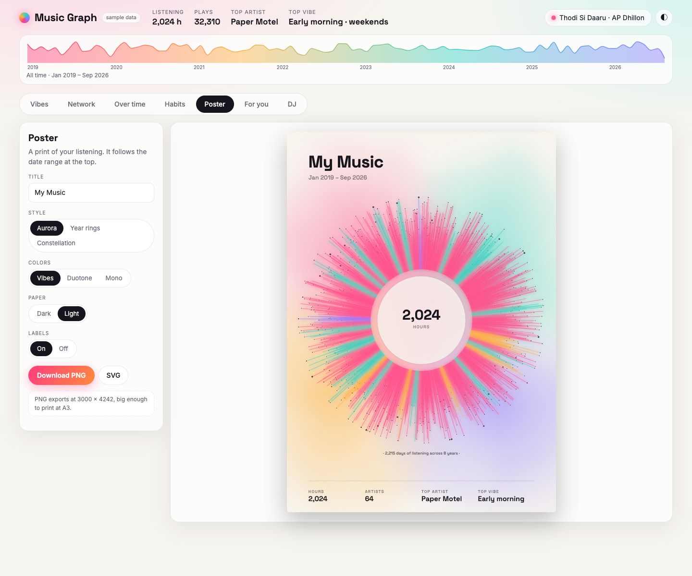 | 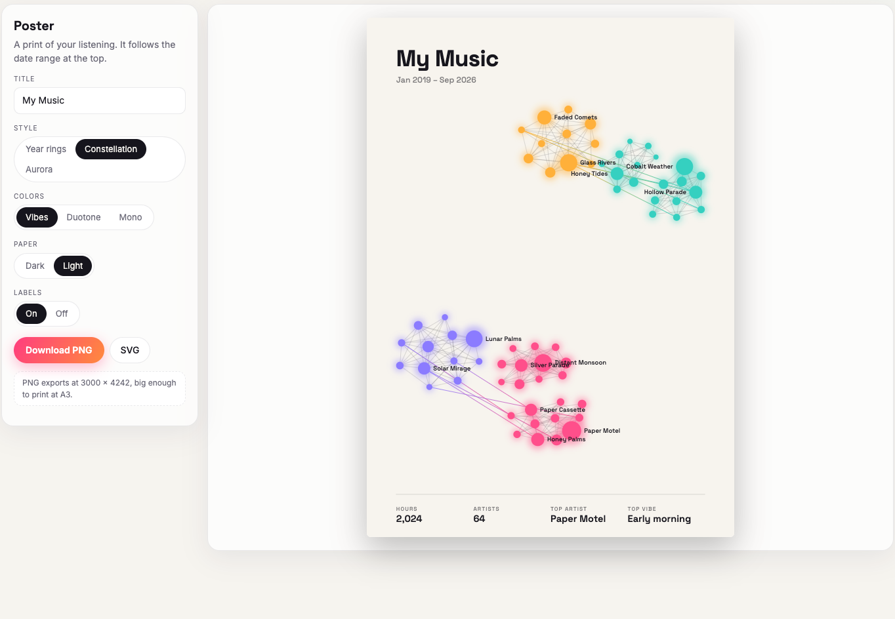 |

Aurora is the light show as a print. Year rings give one ring per year and one bar per day, with beads on the days your vibes crossed over. Constellation places your artists as stars, linked by co-listening.

## For you

Pick a vibe and get a playlist built from your own history: songs you love that fit the mood. The slider moves between rediscovery and current favorites, and every song says why it was picked. Play it through Spotify on this Mac, or save it as a private playlist.

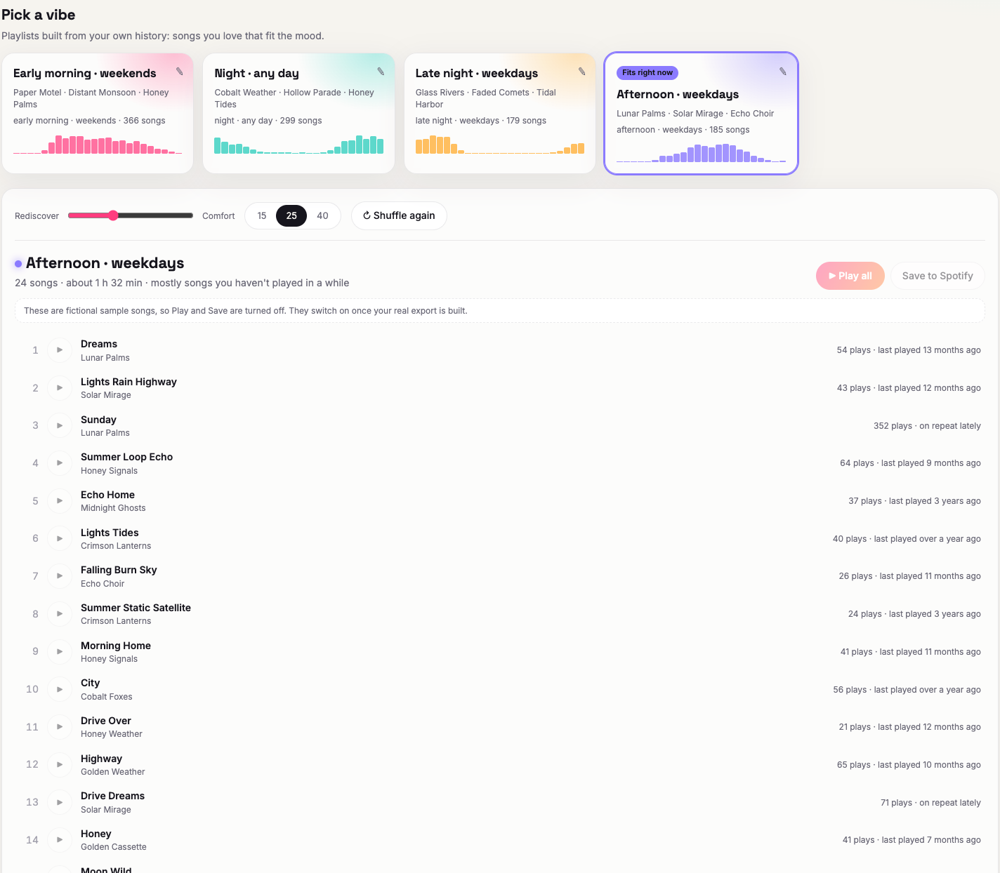

## Now Playing

When a song plays, the page becomes a full-screen light show in the album's colors. It reacts to the actual sound through your mic (or BlackHole), and shows where the song sits in your taste map and your history with it.

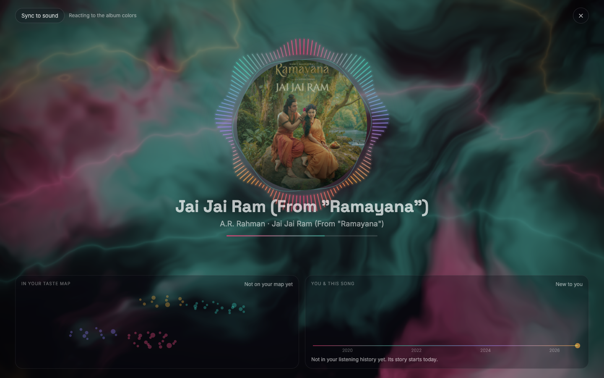

## DJ

Two decks for audio files you own — Spotify's audio is protected, so it can't be mixed here. BPM and key detection, beat sync with key lock, loops, hot cues, EQ, filters, crossfader, and WAV recording of your mix.

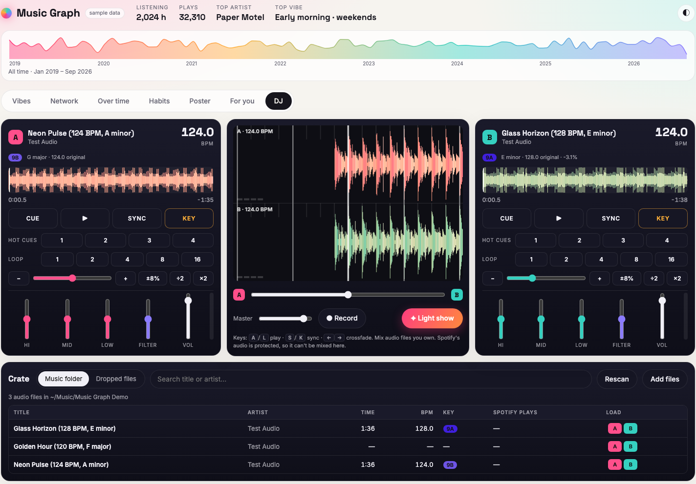

The light show can run off your mix instead of Spotify, with both waveforms and the crossfader on screen.

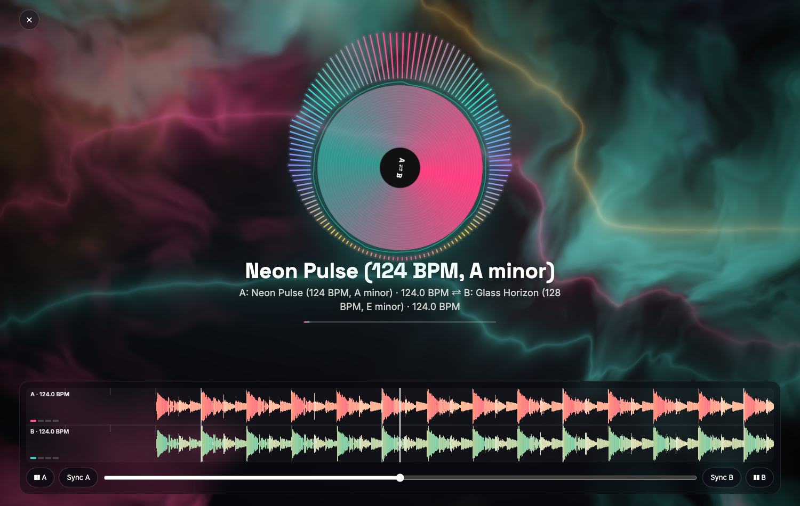
