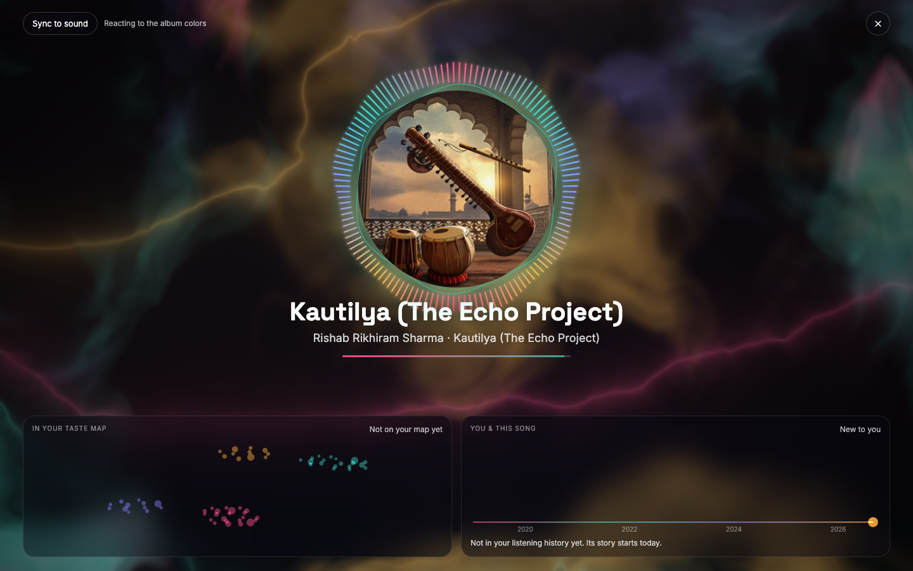
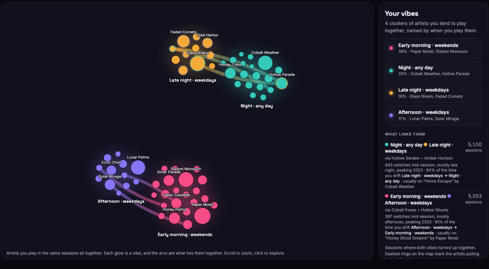

# Music Graph

Your Spotify listening history, turned into something you can explore, print and play with. Runs entirely on your own machine.


## Run it

```bash
uv venv --python 3.12 .venv && uv pip install --python .venv/bin/python -r requirements.txt
```

```bash
.venv/bin/python make_sample_data.py && .venv/bin/python build_data.py --sample
```

```bash
python3 server.py --open
```

That opens <http://127.0.0.1:8765> on generated sample data, so you can look around straight away.

**To use your own listening:** request your **Extended streaming history** from [spotify.com/account/privacy](https://www.spotify.com/account/privacy/), put the zip in `data/raw/`, and run `.venv/bin/python build_data.py`. Spotify can take up to 30 days to send it.

Setup details, the DJ reference and how everything is computed are in the **[guide](GUIDE.md)**. The **[project brief](spotify_graph.md)** records every decision and what's been verified.

---

## Vibes

Artists you play in the same sessions are grouped into "vibes", named by when you play them. Arcs show what bridges one vibe to another, and the panel says why: how often you switch mid-session, which direction you drift, and the song you usually cross over on.


## Network

The same artists as a web of co-listening. Links that cross between vibes are drawn in both vibes' colors, and "Bridges only" fades everything that stays inside one vibe.


## Over time

A streamgraph of your top artists, or of your vibes, month by month. Drag across the bar at the top of any view to zoom into a period; every view follows that range.


## Habits

When you listen, hour by hour across the week, with your peak outlined. Below it: biggest day, longest streak, share of days with music, weekend share, and a calendar where every square is a day.


## Poster

A print of your listening, exported as PNG (3000 × 4242) or SVG.

| Aurora | Year rings | Constellation |
| --- | --- | --- |
|  |  |  |

Aurora is the light show as a print. Year rings give one ring per year and one bar per day, with beads on the days your vibes crossed over. Constellation places your artists as stars, linked by co-listening.

## For you

Pick a vibe and get a playlist built from your own history: songs you love that fit the mood. The slider moves between rediscovery and current favorites, and every song says why it was picked. Play it through Spotify on this Mac, or save it as a private playlist.


## Now Playing

When a song plays, the page becomes a full-screen light show in the album's colors. It reacts to the actual sound through your mic (or BlackHole), and shows where the song sits in your taste map and your history with it.



## DJ

Two decks for audio files you own — Spotify's audio is protected, so it can't be mixed here. BPM and key detection, beat sync with key lock, loops, hot cues, EQ, filters, crossfader, and WAV recording of your mix.


The light show at the top of this page is a live mix: both decks' colors in the aurora, both waveforms and the crossfader on screen.

## Light and dark

The whole app follows your system theme, and the toggle in the header overrides it. `?theme=dark` or `?theme=light` opens it either way.



## Privacy

Everything runs locally. Your export never leaves the machine: `data/raw/` and the generated `data/*.json` are gitignored, the server only listens on `127.0.0.1` and refuses requests from other sites, and Spotify login tokens stay in your browser.

## Requirements

macOS (the Now Playing and crate features use AppleScript and Spotlight), Python 3.12 for the pipeline, Python 3 for the server, and a Chromium-based browser or Safari. No build step, no framework.

## License

MIT — see [LICENSE](LICENSE).
